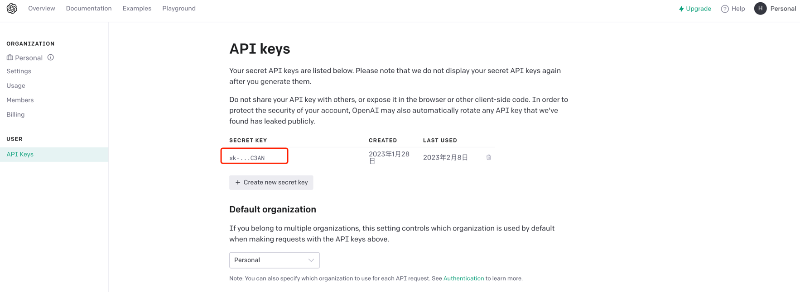
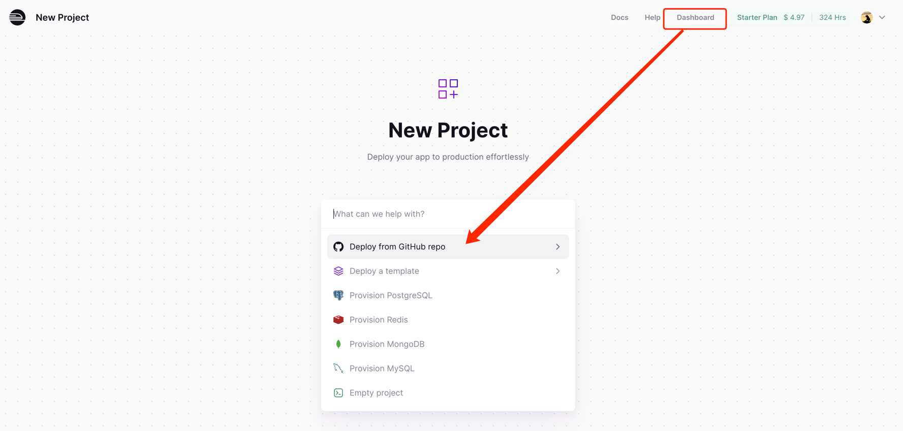
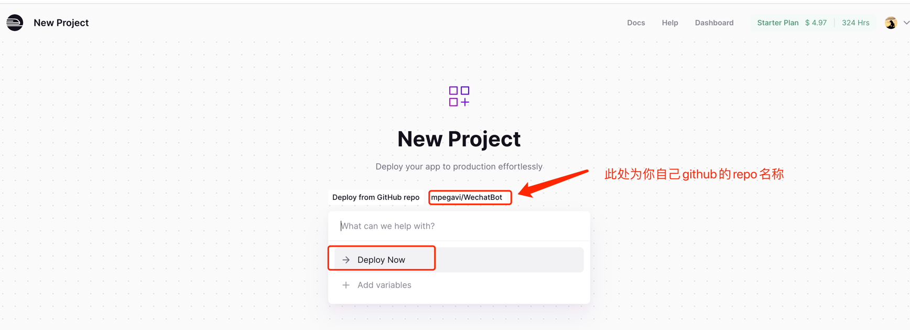
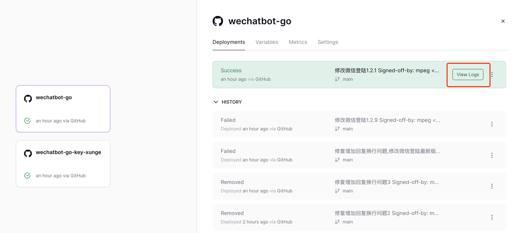
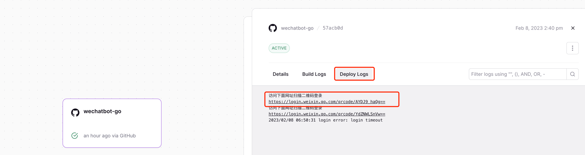

# wechatbot
最近chatGPT异常火爆，想到将其接入到个人微信是件比较有趣的事，所以有了这个项目。项目基于[openwechat](https://github.com/eatmoreapple/openwechat)
开发
###目前实现了以下功能
 + 群聊@回复
 + 私聊回复
 + 自动通过回复
 
# 注册openai账号
chatGPT注册可以参考[这里](https://juejin.cn/post/7173447848292253704)

# 安装使用

# 1.本地启动项目
````
# 获取项目
git clone https://github.com/mpegavi/wechatbot-go-x11.git

# 进入项目目录
cd wechatbot

# 复制配置文件
copy config.dev.json config.json
启动前需替换config.json中的api_key为下图标红地方。
````


```
# 启动项目
go run main.go
```
---------------

# 2.使用railway自动部署启动项目
```
# 1) fork 项目至自己的仓库 （请设置为私有项目）

# 2) 获取项目
git clone https://github.com/$fork项目名

# 3) 进入项目目录
cd $fork项目名

# 4）复制修改配置文件
copy config.dev.json config.json
vi config.json中的api_key为下图标红地方。
````


并提交至自己的github仓库

5）[railway注册一个账号](https://railway.app/)

6）
   进入 Dashboard->Deploy from GitHub repo->选择$fork项目名(初此需要登陆github账号赋权限)

   ->Deploy Now 就可以了。

7）railway会自动从你的仓库拉取代码，编译

绿色的Success出现后点击上图中的 "View logs" 按钮

8）扫描要使用机器人的微信 二维码 （注意：机器人微信需要实名的）


好了，就可以体验chatgpt微信机器人的旅程了。


